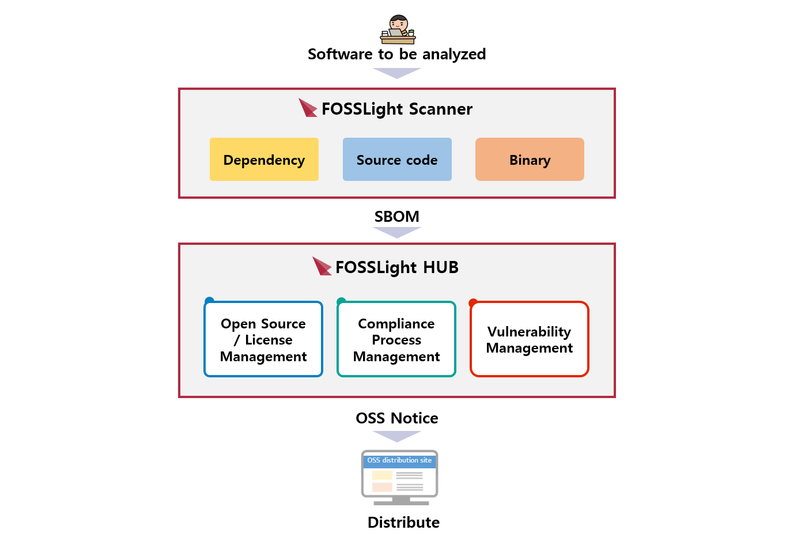

<h2 style="font-size: 500%">  FOSSLight  </h2>
<h5>오픈 소스를 사용하여 소프트웨어를 개발하고 배포할 때,  오픈 소스 거버닝을 위해 FOSSLight을 활용하실 수 있습니다.</h5>

<h5>FOSSLight Scanner는 소스코드, 바이너리, 디펜던시에 대한 Open Source 분석을 수행하고, 그 결과 추출 가능한 오픈 소스 정보를 포함한 보고서를 생성합니다. FOSSLight Hub는 오픈 소스, 오픈 소스 라이선스, 그리고 보안취약점까지 관리해줌으로써 오픈 소스 라이선스 의무사항을 준수하고 보안취약점으로부터 안전하게 사용할 수 있습니다. 또한 프로젝트 별 BOM(Bill Of Materials) 관리, 오픈 소스 라이선스의 의무사항 및 보안취약점 조회 기능을 제공하여 OSC(Open Source Compliance) Process를 수행할 수 있도록 도와줍니다.</h5>
 

<button class="learn-more" onclick="location.href='fosslight'">
  
    
  
  Learn More
</button>

 
 
 

<h2 style="color: rgb(191, 13, 63); text-align: center;">Companies and Organizations Using FOSSLight</h2>

 
 
 
