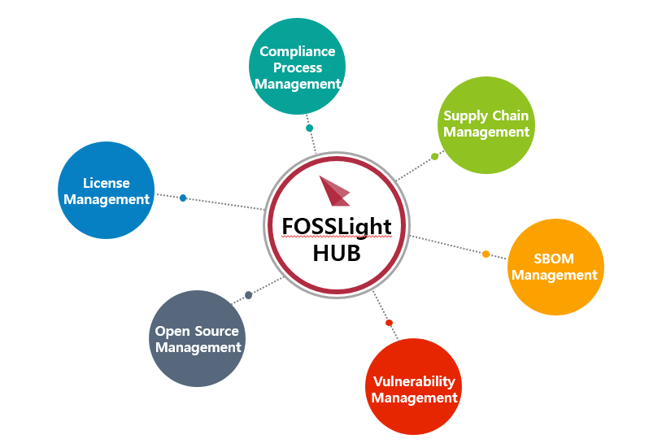
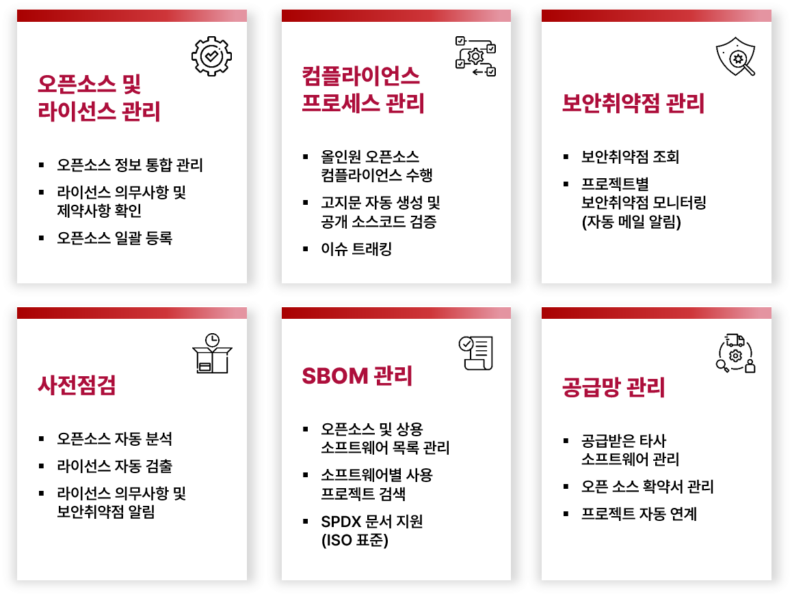

* toc
{:toc}

## What is FOSSLight Hub?

 
FOSSLight Hub는 오픈 소스, 오픈 소스 라이선스, 그리고 보안취약점까지 관리해줌으로써 오픈 소스 소프트웨어 사용 시 Compliance를 준수하고 보안취약점으로부터 안전하게 사용할 수 있습니다. 또한 프로젝트 별 BOM 관리, 오픈 소스 라이선스의 의무사항 및 보안취약점 조회 기능을 제공하여 OSC(Open Source Compliance) Process를 수행할 수 있도록 도와줍니다.

OSC Process에 대한 더욱 자세한 정보는 **OSC Process 가이드**(<a href="https://oss.lge.com/guide-ko/process/osc_process/"><b>https://oss.lge.com/guide-ko/process/osc_process/</b></a>)를 참조하시기 바랍니다.

## Features

 

## Documentation

설치 및 사용 방법에 대해서는 <a href="https://fosslight.github.io/fosslight-guide/"><b>FOSSLight 가이드</b></a>를 참조하시기 바랍니다.

## Source Code

Github Repository : <a href="https://github.com/fosslight/fosslight"><b>https://github.com/fosslight/fosslight</b></a>

## License

FOSSLight Hub는 Open Source License인 <a href="https://github.com/fosslight/fosslight_system/blob/main/LICENSE"><b>AGPL-3.0-only</b></a> 하에 배포되고 있습니다.

## Contact

다음 Slack 링크를 통해 FOSSLight Community에 참여하실 수 있습니다 : [**https://fosslight.slack.com**](https://fosslight.slack.com)  
버그 리포팅이나 신규 기능 요청은 [**Github issues**](https://github.com/fosslight/fosslight/issues)를 통해 요청해 주시기 바랍니다.