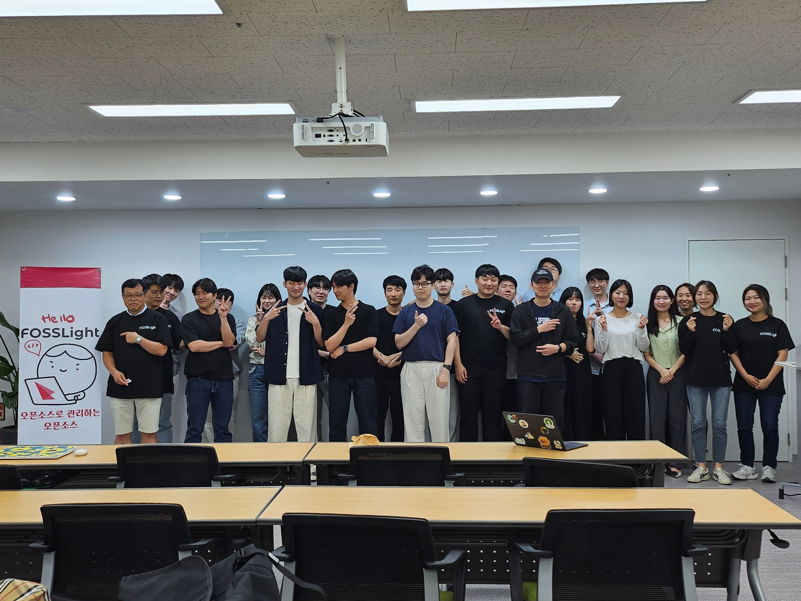
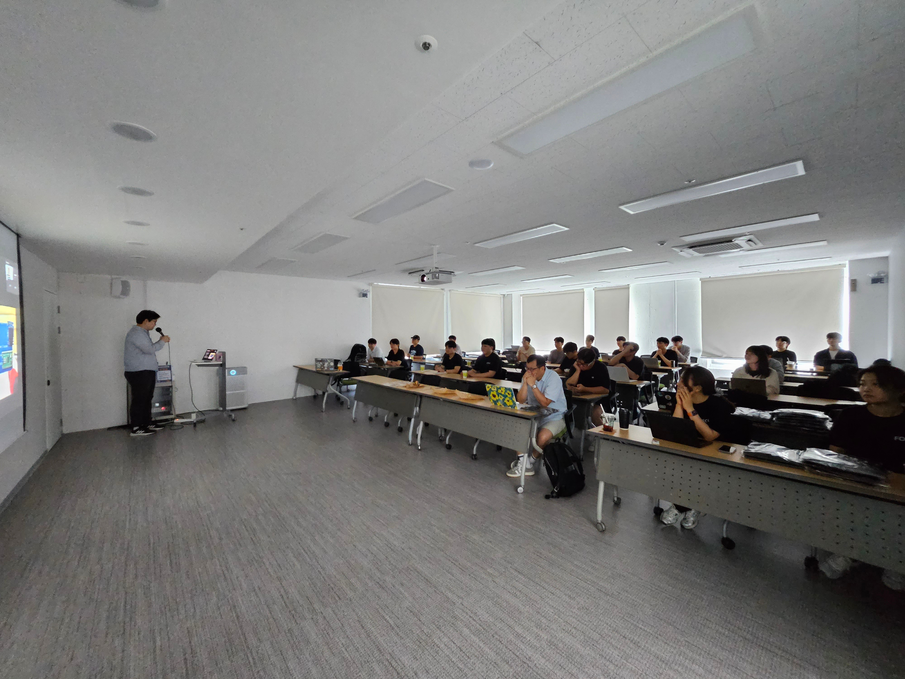
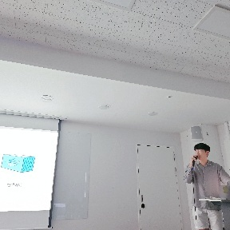
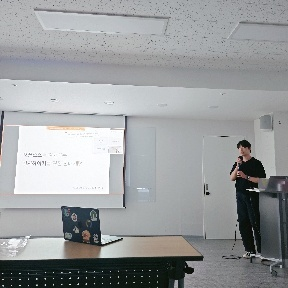
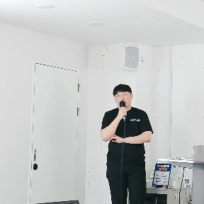
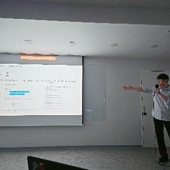
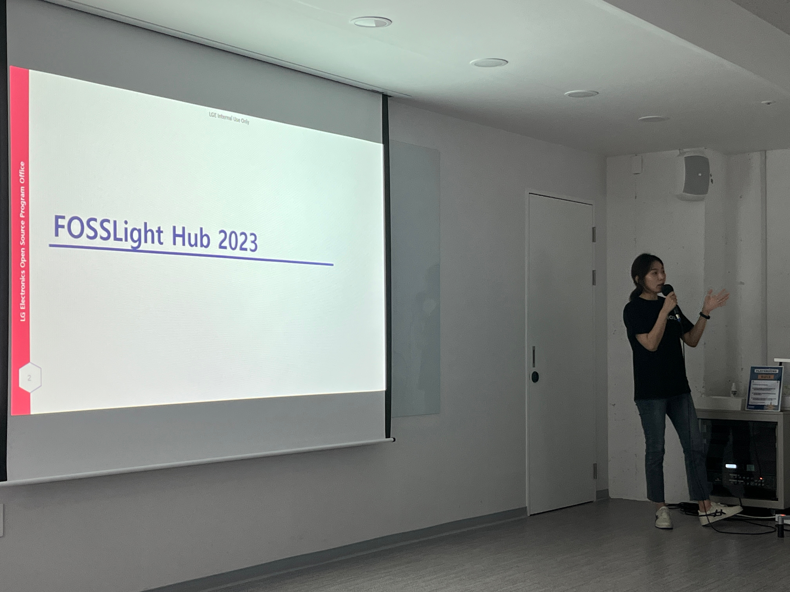

2023.09.02일 14:00PM 제 1회 FOSSLight Community Day가 개최되었습니다. FOSSLight Hub를 개발 및 운영할 때, 알아두면 좋은 지식을 공유하는 자리를 가졌습니다.     
  
 
 
 
  
 
  
 
  

발표 자료 
- [FOSSLight 로드맵 - 김소임](../../assets/files/SoimKim.pptx)
- [슬기로운 자바 코딩 생활 - 김동훈](../../assets/files/DonghoonKim.pdf)
- [슬기로운 자바 코딩 생활 - 정다빈](../../assets/files/DabeenJeong.pptx)
- [백엔드 개발자가 가져야할 기본적인 클라우드 지식 - 지승민](../../assets/files/Gseungmin.pptx)
- [NVD 보안취약점 딥다이브 - 김명현](../../assets/files/MyunghyunNero.pptx)
- [오픈소스를 여행하는 히치하이커를 위한 안내서 - 한종우](../../assets/files/JongwooHan.pdf)