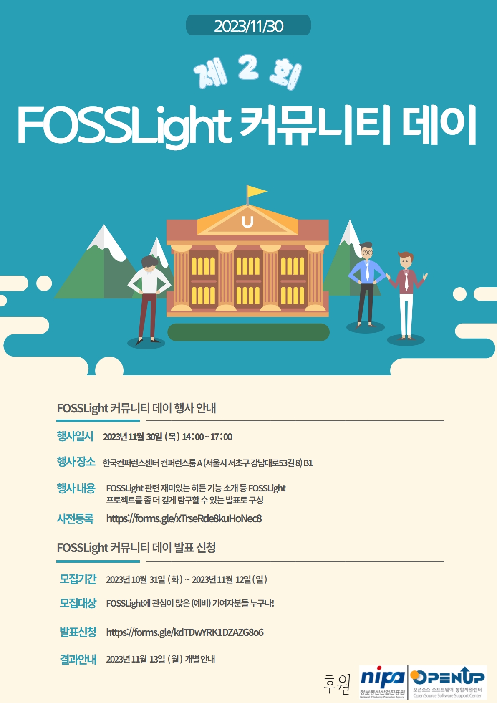

## 2nd FOSSLight Community Day 예고

### 사전 등록
아래 FOSSLight Community Day 사전 등록 링크를 통해 참여 신청 부탁드립니다!!
 - 일시 : 2023.11.30 14:00 ~ 17:00
 - 장소 : 한국컨퍼런스센터 컨퍼런스룸 A (서울시 서초구 강남대로53길 8) B1 (강남역 5번 출구)
 - FOSSLight Community Day 사전 등록 : [https://forms.gle/xTrseRde8kuHoNec8](https://forms.gle/xTrseRde8kuHoNec8)
    - 🎁사전 등록하시어 참가 선물 받으세요🎁 (선착순 40명)

### Agenda

|Time|제목|설명|발표자|
|--- | --- |--- | --- |  
|13:40 ~ 14:00|행사 등록| ||
|14:00 ~ 14:15|Keynote|리눅스 파운데이션의 Shane Coughlan의 오프닝! 온라인이 아닌 현장으로 모셨습니다. |[Shane Coughlan](https://www.linkedin.com/in/shanecoughlan/?originalSubdomain=jp)(The Linux Foundation)|
|14:15 ~ 14:45|FOSSLight Hub for 뉴비|FOSSLight Hub 운영을 위한 설치 및 실행, 업데이트 방법을 소개합니다.|민경선(LG전자)|
|14:45 ~ 15:15|FOSSLight Scanner for 뉴비|FOSSLight Scanner의 구성 요소를 소개하고 실행하는 방법을 소개합니다.|석지영(LG전자)|
|15:15 ~ 15:30| 휴식 | ||
|15:30 ~ 15:50|OLA: FOSSLight 기반 ETRI 오픈 소스 관리 시스템|ETRI는 오픈소스 리스크를 인식하여 라이선스 검증 프로세스를 운영하고 있었는데, 점점 검증량이 많아지면서 자동화가 필요하게 되었습니다. 이에 공개된 FOSSLight를 기반으로 ETRI에 맞는 시스템을 구축하여 활용 중입니다. 본 발표에서는 FOSSLight 기반 ETRI 오픈소스 관리 시스템인 OLA에 대해 소개합니다.|박정숙(ETRI)|
|15:50 ~ 16:05|고수들의 FOSSLight Hub 사용법|FOSSLight Hub 사용자라면 알아두면 좋은 꿀팁을 소개합니다.|[김소임](https://www.linkedin.com/in/soim-kim-093036216/)(LG전자)|
|16:05 ~ 16:15| 휴식 | ||
|16:15 ~ 16:35|FOSSLight Hub ERD 소개|FOSSLight Hub 개발을 위해 알아두면 좋은 ERD(Entity Relationship Diagram)을 소개합니다 |윤성원(씽크트리)|
|16:35 ~ 17:00|FOSSLight 현재와 미래 개봉박두|SBOM 지원을 위해 새롭게 추가된 기능을 소개하고 24년 로드맵을 짜잔 공개합니다.|[김경애](https://www.linkedin.com/in/kyoungae-kim-597a1630/)(LG전자)|

### Event 🎉
사전 등록하신 분에 한하여 참가 선물🎁을 드립니다.(선착순 40명)     
굉장히 핫한 아이템이라는 점~!! 서두르세요 😃     
{: width="150" height="150"}
