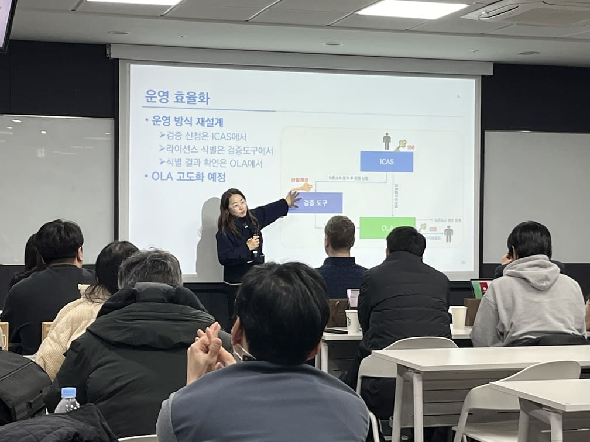
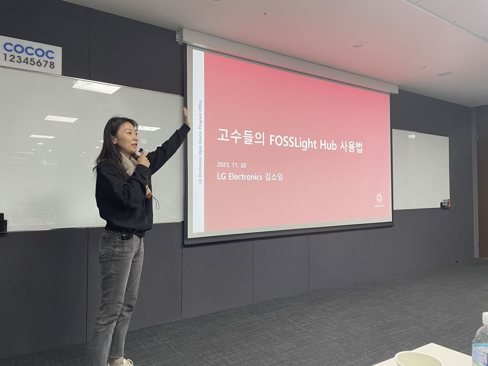
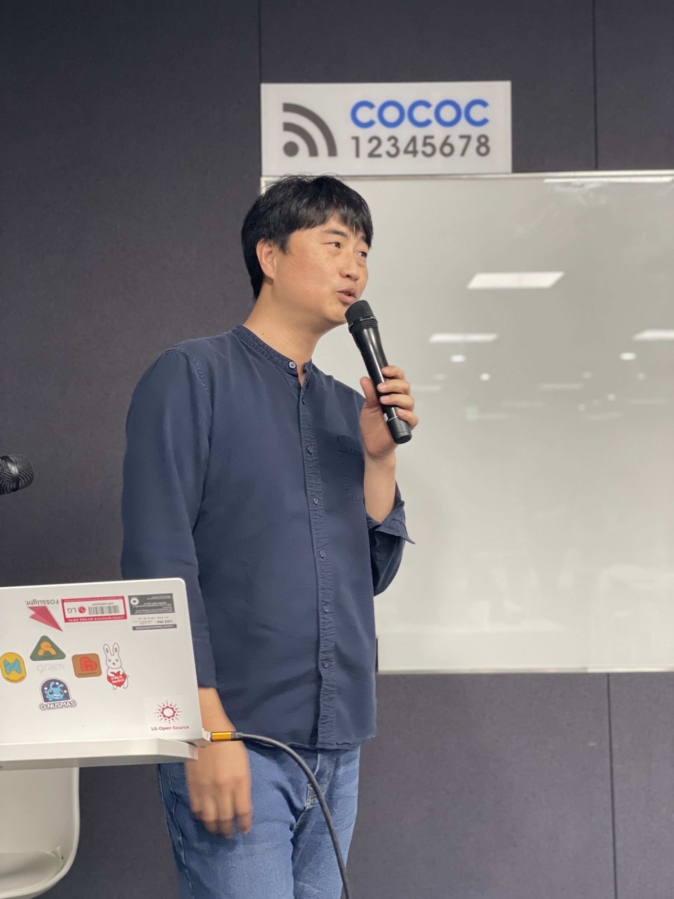
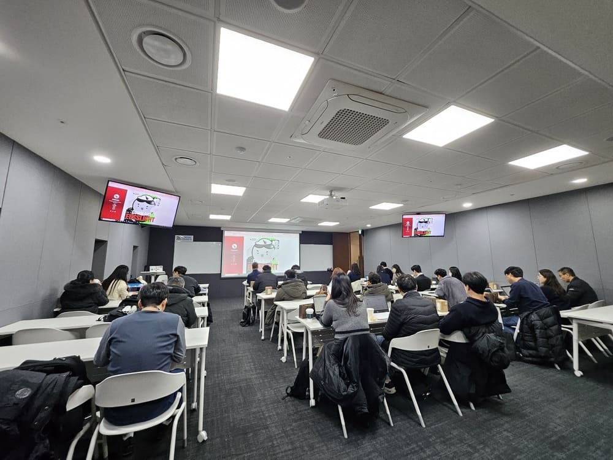

2023.11.30 제 2회 FOSSLight Community Day가 개최되었습니다.   
이번 FOSSLight Community Day에는 많은 기업의 담당자분들께서 참석하였습니다. FOSSLight Hub와 FOSSLight Scanner를 개발 및 운영할 때, 알아두면 좋은 지식과 FOSSLight Hub를 활용하여 구축한 시스템인 ETRI의 OLA 소개가 있었습니다.
       
발표 자료 
- [FOSSLight Hub for 뉴비 - 민경선(LG전자)](../../assets/files/231130/Hub_for_newbie.pdf)
- [FOSSLight Scanner for 뉴비 - 석지영(LG전자)](../../assets/files/231130/Scanner_for_newbie.pdf)
- [OLA: FOSSLight 기반 ETRI 오픈 소스 관리 시스템 - 박정숙(ETRI)](../../assets/files/231130/OLA.pdf)
- [고수들의 FOSSLight Hub 사용법 - 김소임(LG전자)](../../assets/files/231130/Hub_tips.pdf)
- [FOSSLight Hub ERD 소개 - 윤성원(씽크트리)](../../assets/files/231130/ERD.pdf)
- [FOSSLight 현재와 미래 개봉박두 - 석지영(LG전자)](../../assets/files/231130/Roadmap.pdf)
      

후원 : Nipa 정보통신산업진흥원    

 
 
 
  
 
  
 

