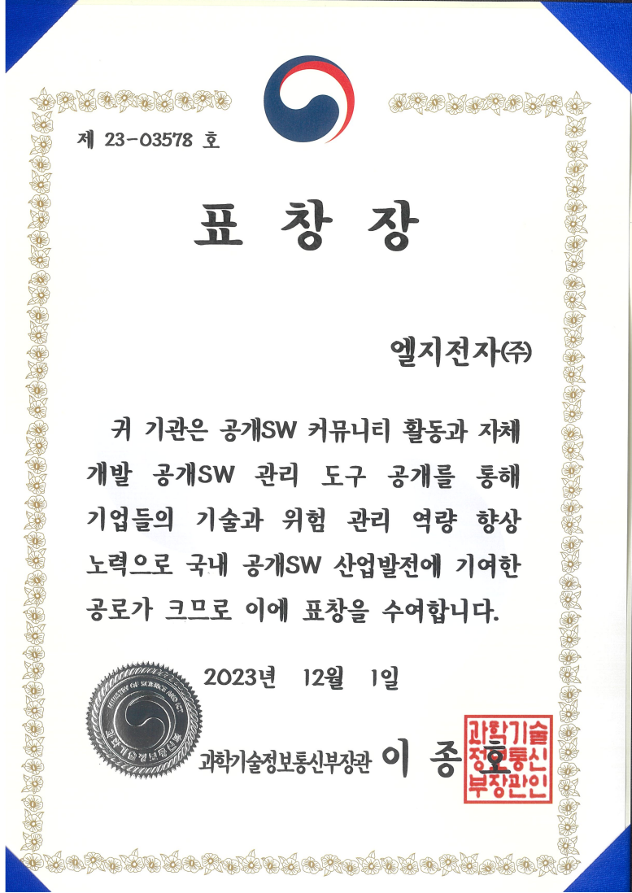

2023.12.01 LG전자는 공개SW 커뮤니티 활동과 자체 개발 공개SW 관리 도구 (FOSSLight Hub, FOSSLight Scanner) 공개를 통해 국내 공개SW 산업발전에 기여한 공로를 인정받아 '2023년도 국내 공개SW 산업발전 유공자 표창 시상식'에서 과학기술정보통신부 장관 표창을 수상했다.

이번 수상은 LG전자가 FOSSLight를 통해 국내 공개SW 산업 발전에 기여한 점을 높이 평가받은 결과다. FOSSLight는 오픈소스 소프트웨어의 라이선스 관리와 보안 취약점 분석을 지원하는 도구로, LG전자는 이를 공개하여 많은 기업과 개발자들이 보다 효율적으로 오픈소스를 활용할 수 있도록 돕고 있다.

LG전자는 오픈소스 소프트웨어의 중요성을 인식하고, 이를 적극적으로 활용하고 기여하는 기업으로서의 역할을 다하고 있다. 특히, FOSSLight를 통해 오픈소스 소프트웨어의 투명한 관리와 보안 강화를 실현함으로써, 국내 SW 산업의 경쟁력을 높이는 데 기여하고 있다.

LG전자 FOSSLight 개발자는 "앞으로도 공개SW 커뮤니티와 협력하여 지속적으로 오픈소스 소프트웨어의 발전을 도모하고, 이를 통해 국내 SW 산업의 경쟁력을 강화해 나가겠다"고 밝혔다.

      
 
 
