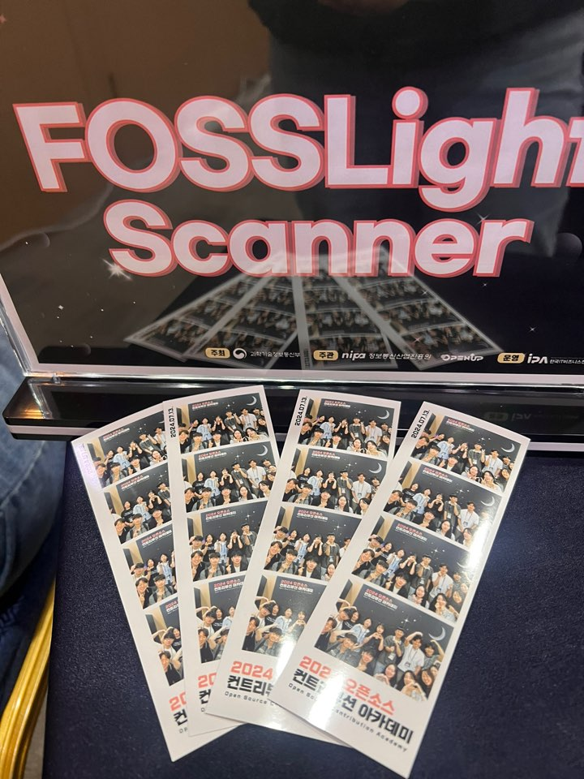
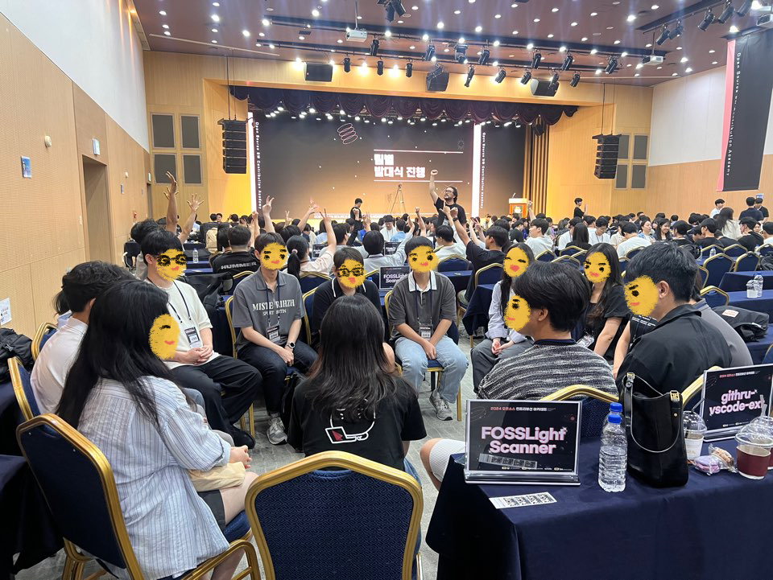

2024년 7월 13일, <a href="https://www.oss.kr/contribution_academy"> 컨트리뷰션 아카데미</a>가 발대식을 통해 본격적인 활동을 시작했다. 이번 아카데미에는 오픈 소스 소프트웨어 스캐너인 FOSSLight Scanner가 참여하여 큰 주목을 받고 있다.

FOSSLight Scanner는 오픈 소스 소프트웨어의 라이선스와 보안 취약점을 분석하는 도구로, 이번 아카데미에서의 활동을 통해 더욱 발전된 기능과 성능을 선보일 예정이다. 특히, 이번 아카데미에서 멘토로 참여한 김소임과 김경애는 FOSSLight Scanner의 개발과 활용에 대한 깊은 지식과 경험을 바탕으로 참가자들에게 실질적인 도움을 제공할 계획이다.

김소임 멘토는 "아카데미를 통해 많은 개발자들이 FOSSLight Scanner를 효과적으로 활용 및 개발할 수 있도록 돕고 싶습니다."라고 말했다. 김경애 멘토 역시 "참가자들이 FOSSLight Scanner를 통해 오픈 소스 프로젝트에 기여하는 방법을 배우고, 이를 통해 더 나은 소프트웨어 생태계를 만들어 나가길 기대합니다."라고 전했다.

컨트리뷰션 아카데미는 오픈 소스 소프트웨어에 대한 이해를 높이고, 개발자들이 실제 프로젝트에 기여할 수 있는 기회를 제공하는 프로그램이다. 이번 발대식을 시작으로 다양한 워크숍, 세미나, 해커톤 등이 진행될 예정이며, 참가자들은 이를 통해 실질적인 경험과 지식을 쌓을 수 있을 것으로 기대된다.

