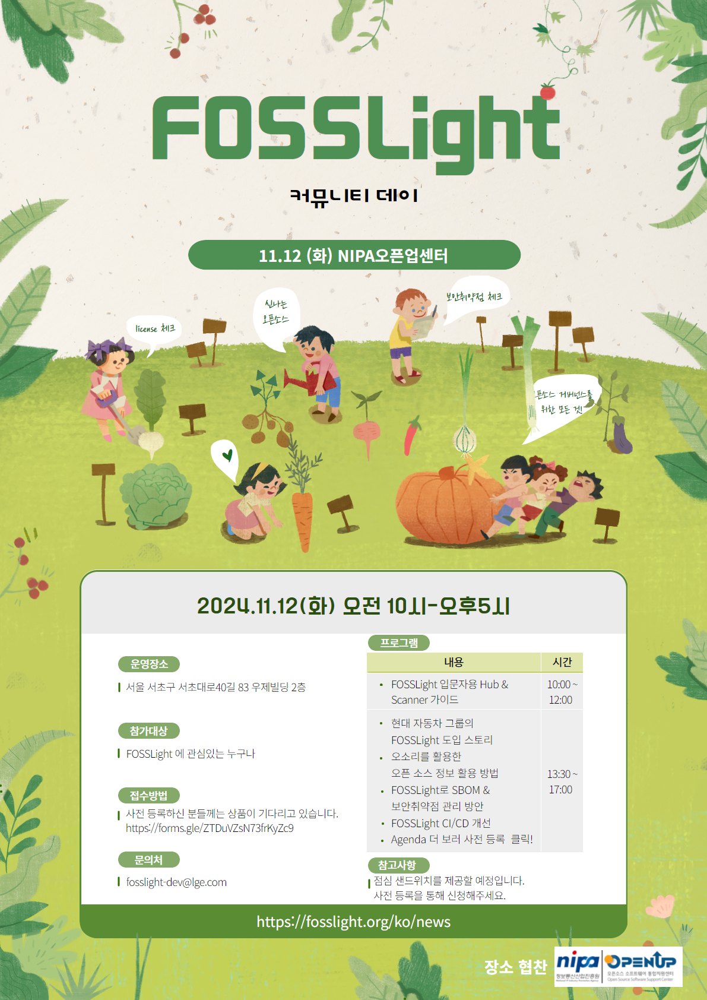

## 제3회 FOSSLight Community Day 예고
 - 일시 : 2024.11.12 화요일 10:00 ~ 17:00
 - 장소 : 서울 서초구 서초대로40길 83 우제빌딩 2층
 - 점심 샌드위치 제공 
 - 오전/오후 세션 선택적 참석 가능

### Agenda

|Time|제목|설명|발표자|
|--- | --- |--- | --- | 
|09:50 ~ 10:00|행사 등록| || 
|10:00 ~ 12:00|FOSSLight 사용 가이드|FOSSLight 입문자를 위한 FOSSLight Scanner & Hub 가이드|[김경애](https://www.linkedin.com/in/kyoungae-kim-597a1630/)(LG전자)|
|12:00 ~ 13:30|점심 시간||
|13:30 ~ 13:50|최신 Updates| 요즘 오픈 소스 세상 소식 및 FOSSLight 소식 |박원재(LG전자)|
|13:50 ~ 14:10|현대자동차그룹 FOSSLight 사용기|현대자동차그룹에서 FOSSLight 도입하게된 배경과 앞으로의 활용계획 소개|백송하(현대자동차)|
|14:10 ~ 14:30|Coffee break||
|14:30 ~ 14:50|오소리 데이터 사용 가이드 |오소리에 대한 간략한 소개와 오소리 데이터 사용 방법 안내 (Swagger API 호출 방법 및 OLIS에서 데이터 조회하기)|[김영환](https://www.linkedin.com/in/%EC%98%81%ED%99%98-%EA%B9%80-4069b5135/ )(카카오)|
|14:50 ~ 15:15|FOSSLight Hub v2.0| UI v2.0의 대변신! API v2.0, 새롭게 추가된 기능을 소개합니다. |이혜인(LG전자)|
|15:15 ~ 15:40|FOSSLight Hub SBOM 및 보안취약점 관리|FOSSLight Hub에서 어떻게 SBOM을 관리할 수 있는지, 오픈소스 보안취약점은 어떻게 매핑하고 있는지 소개합니다.|석지영(LG전자)|
|15:40 ~ 16:00|Coffee break| ||
|16:00 ~ 16:25|FOSSLight Scanner v2.0|v2.0에서 추가된 기능, GUI Tool, VS Code extension을 소개합니다.|[김소임](https://www.linkedin.com/in/soim-kim-093036216/)(LG전자)|
|16:25 ~ 16:45|FOSSLight CI/CD 파이프라인 개선 및 사용자 경험 향상|FOSSLight 프로젝트의 배포 프로세스 자동화, 다양한 플랫폼에서의 사용성 개선 (VSCode, GUI, Docker), 테스트 코드 개선을 통한 품질 향상을 소개합니다.|[권순홍](https://velog.io/@nanayah99/posts)|
|16:45 ~ 17:00|FOSSLight 로드 맵||[김경애](https://www.linkedin.com/in/kyoungae-kim-597a1630/)(LG전자)|

### Event 🎉
11/8까지 사전 등록하시어 참가 선물과 점심 샌드위치 신청하세요🎁
