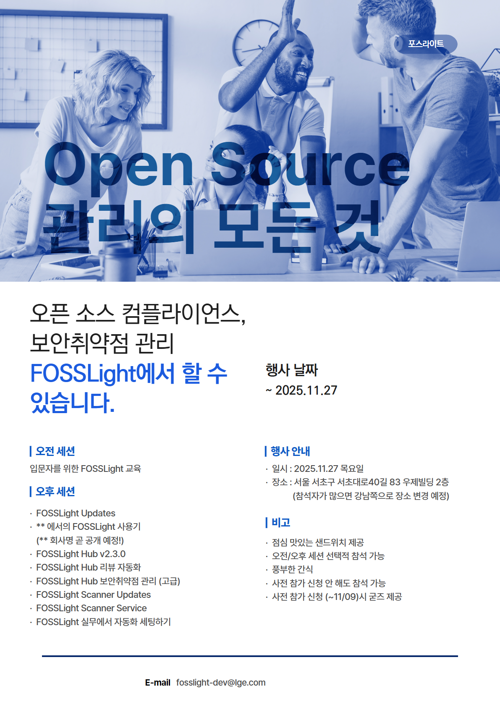

## 제4회 FOSSLight Community Day 예고
 - 일시 : 2025.11.27 목요일
 - 장소 : 서울 서초구 서초대로40길 83 우제빌딩 2층 
 - 점심 샌드위치 제공 
 - 오전/오후 세션 선택적 참석 가능
 - 참가 신청 링크 (~ 25/11/9까지): [https://forms.gle/mHRRfqrkc3YoEevNA](https://forms.gle/mHRRfqrkc3YoEevNA)

### Agenda
* agenda는 일부 수정될 수 있습니다.

|Time|제목|설명|발표자|
|--- | --- |--- |--- |
|09:50 ~ 10:00|행사 등록| |  | 
|10:00 ~ 12:00|FOSSLight 사용 가이드|FOSSLight 입문자를 위한 FOSSLight Scanner & Hub 가이드|방재권(LG전자), 최혜성(LG전자)| 
|12:00 ~ 13:30|점심 시간|| | 
|13:30 ~ 13:35|오프닝|  | [김경애](https://www.linkedin.com/in/kyoungae-kim-597a1630/)(LG전자)| 
|13:35 ~ 13:50|최신 Updates| 요즘 오픈 소스 세상 소식 및 FOSSLight 소식 | [박원재](https://www.linkedin.com/in/wonjae-park/)(LG전자)| 
|13:50 ~ 14:15|현대오토에버 FOSSLight 도입 및 확장 사례| 오픈소스 관리도구 도입 과정, 확장 사례, 유용한 기능, 그룹 전파 계획!|이지현(현대오토에버)| 
|14:15 ~ 14:30|Coffee break|||
|14:30 ~ 14:55|FOSSLight Hub Updates| 새롭게 추가된 기능을 공개합니다. |석지영(LG전자)|
|14:55 ~ 15:20|FOSSLight Hub 리뷰 자동화| 당신의 시간을 절약해주는 리뷰 자동화 방법을 소개합니다. |민경선(LG전자)|
|15:20 ~ 15:45|FOSSLight Scanner Service |FOSSLight Scanner를 웹서비스로 제공하는 서비스 소개|이일용(LG전자)|
|15:45 ~ 16:00|Coffee break| ||
|16:00 ~ 16:25|FOSSLight Hub를 활용한 공급망 보안체계 구축|  |[김경애](https://www.linkedin.com/in/kyoungae-kim-597a1630/)(LG전자)|
|16:25 ~ 16:45|FOSSLight 실무 자동화 세팅 |자동화 세팅 사례를 공유합니다.|[김소임](https://www.linkedin.com/in/soim-kim-093036216/)(LG전자) |
|16:45 ~ 15:00|클로징||

### Event 🎉
11/9까지 사전 등록하시어 참가 선물과 점심 샌드위치 신청하세요🎁