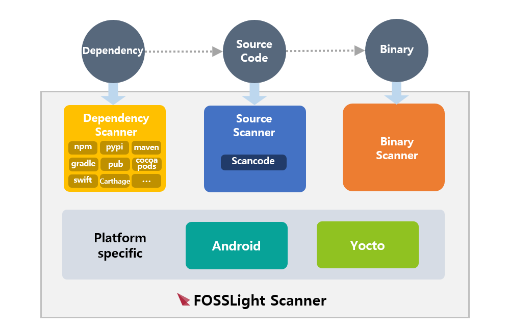

* toc
{:toc}

## Introduction

FOSSLight Scanner는 Open Source Compliance를 위한 분석 과정을 한번에 수행 가능한 툴입니다. 소스코드, 바이너리, 디펜던시에 대한 Open Source 분석을 수행하고, 저작권/License 표기 규칙 준수 여부를 체크할 수 있습니다. Open Source 분석 수행시, 추출 가능한 오픈 소스 정보를 포함한 보고서를 생성하며, 해당 보고서는 [FOSSLight Hub](/fosslight)의 입력 값으로 활용할 수 있습니다.

## Features

  

    

      

        <i class="fa-solid fa-magnifying-glass"></i>
      

      <h3>오픈소스 분석 정확도 향상</h3>
      

        
소스코드 문자열 검출 및 스니펫 매칭을 지원하며, 다양한 패키지 매니저에 대한 디펜던시 분석뿐만 아니라 바이너리 분석까지 지원하여 오픈소스 분석 정확도를 높일 수 있습니다.
        

      

    

  

  

    

      

        <i class="fas fa-gears"></i>
      

      <h3>독립 모듈을 통한  빠른 실행 속도</h3>
      

        
각 스캐너는 독립적으로 실행 가능함으로써, 원하는 스캔(ex, 소스코드, 바이너리, 디펜던시) 대상에 대해서만 빠르고 가볍게 실행할 수 있습니다.

      

    

  

  

    

      

        <i class="fa-solid fa-share-nodes"></i>
      

      <h3>Hub 연동을 통한 기능 확장</h3>
      

        
스캐너 결과 파일은 Hub에서 바로 이용 가능함으로써, Hub를 통한 오픈소스 정보 통합 관리 및 SBOM 지원 기능을 이용할 수 있습니다.

      

    

  

## Description

FOSSLight Scanner 프로젝트는 다른 오픈 소스 프로젝트를 **상속**합니다.

- FOSSLight Prechecker는 Reuse 준수 여부 체크시 **[reuse-tool](https://github.com/fsfe/reuse-tool)** 오픈 소스를 이용합니다.
- FOSSLight Source Scanner는 소스코드 스캔 작업을 위해 **[scancode-toolkit](https://github.com/nexB/scancode-toolkit)** 및 **[scanoss.py](https://github.com/scanoss/scanoss.py)** 오픈 소스를 이용합니다.
- FOSSLight Dependency Scanner는 Package manager에 따라 다음 오픈소스를 이용하여 디펜던시 분석을 수행합니다.
  - NPM : **[NPM License Checker](https://github.com/davglass/license-checker)**
  - Pypi : **[pip-licenses](https://github.com/raimon49/pip-licenses)**
  - Gradle : **[License Gradle Plugin](https://github.com/hierynomus/license-gradle-plugin)**
  - Maven : **[license-maven-plugin](https://github.com/mojohaus/license-maven-plugin)**
  - Pub : **[flutter_oss_licenses](https://github.com/espresso3389/flutter_oss_licenses)**
  - Android(gradle) : **[android-dependency-scanning](https://github.com/fosslight/android-dependency-scanning)**
- FOSSLight Binary Scanner는 jar 파일에 대한 오픈 소스 분석 시, **[Dependency-check-py](https://github.com/jhermann/dependency-check-py)** 오픈 소스를 이용합니다.

## Scanner Projects

- [**FOSSLight Scanner**](https://github.com/fosslight/fosslight_scanner) (License: [**Apache-2.0**](https://github.com/fosslight/fosslight_scanner/blob/main/LICENSE))
- [**FOSSLight Prechecker**](https://github.com/fosslight/fosslight_prechecker) (License: [**GPL-3.0-only**](https://github.com/fosslight/fosslight_prechecker/tree/main/LICENSES))
- [**FOSSLight Source Scanner**](https://github.com/fosslight/fosslight_source_scanner) (License: [**Apache-2.0**](https://github.com/fosslight/fosslight_source_scanner/blob/main/LICENSE))
- [**FOSSLight Dependency Scanner**](https://github.com/fosslight/fosslight_dependency_scanner) (License: [**Apache-2.0**](https://github.com/fosslight/fosslight_dependency_scanner/blob/main/LICENSE))
- [**FOSSLight Binary Scanner**](https://github.com/fosslight/fosslight_binary_scanner) (License: [**Apache-2.0**](https://github.com/fosslight/fosslight_binary_scanner/blob/main/LICENSE))
- [**FOSSLight Yocto Scanner**](https://github.com/fosslight/fosslight_yocto_scanner) (License: [**Apache-2.0**](https://github.com/fosslight/fosslight_yocto_scanner/blob/main/LICENSE))
- [**FOSSLight Android Scanner**](https://github.com/fosslight/fosslight_android_scanner) (License: [**Apache-2.0**](https://github.com/fosslight/fosslight_android_scanner/blob/main/LICENSE))

 
 

<a href="https://icons8.com/icon">&lt;Icons by Icons8&gt;</a>

